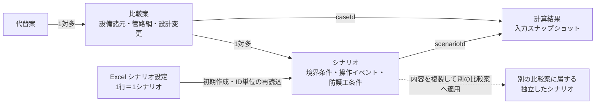

# 比較案・シナリオ・Excel入力の役割

## 用語と責任

| 単位 | 変えるもの | 変えないもの | 例 |
|---|---|---|---|
| 代替案 | 路線、施設構成など設計上の大きな方針 | — | 自然流下案、ポンプ圧送案 |
| 比較案 | 設備諸元、管路網モデル、設計変更 | 同じ比較案で評価する操作条件 | 管径変更、弁形式変更、防護設備追加 |
| シナリオ | 境界条件、操作イベント、防護工の運用条件 | 設備諸元と管路網モデル | 急閉そく、緩閉そく、ポンプ停止、停電 |
| 計算 | 1つの比較案と1つのシナリオを、1つの計算方法で評価した記録 | 入力スナップショット | 管径案A×急閉そく×過渡解析 |

内部型の `Case` は画面では「比較案」と呼ぶ。水理分野で用いる「計算ケース」と混同しないため、Excelの旧「ケース設定」シートは「シナリオ設定」へ改称する。

## 関係図

計算結果は、`caseId` で1つの比較案、`scenarioId` でその比較案に属する1つのシナリオを参照する。したがって「管径案A × 急閉そく × 管路網の過渡解析」と「管径案A × 緩閉そく × 管路網の過渡解析」は、比較案が同じでも別の計算結果として保存される。

## 多対多の扱い

1つの比較案には複数のシナリオを登録できる。同じ操作条件で複数の比較案を評価する必要があるため、概念上は同じシナリオを複数の比較案へ適用できる必要がある。

一方、計算記録の検証可能性を保つため、保存時はシナリオを比較案ごとのスナップショットとして持つ。別の比較案へ適用するときは内容を複製し、後の編集が既存の計算記録へ波及しない構造とする。将来、複製元を横断管理する場合も、共有参照ではなく同一系列を示す識別子を追加する。

## スキーマと `.owhproj` の互換・移行方針

この整理では、contracts のスキーマ変更も `.owhproj` の移行も不要である。既存の `Scenario.caseId` と `Run.caseId` / `Run.scenarioId` が上の関係をすでに表現でき、複数シナリオも既存配列の件数が増えるだけだからである。

- contracts の `schemaVersion` は `1.0.0` のままとする。
- `.owhproj` の bundle format version は `1` のままとする。
- バンドルの `scenarioIds` には、対象プロジェクトに属する全シナリオを列挙する。1比較案に複数シナリオがあっても形式は変わらない。
- 旧ファイルに比較案ごとのシナリオが1件しかなくても、その1件をそのまま読み込む。補完、複製、削除などの自動移行は行わない。
- 計算結果は従来どおり `caseId` と `scenarioId` の両方を検証するため、既存の計算記録との対応関係を保持する。
- 製品バージョンが異なっても、`schemaVersion` と bundle format version が対応範囲内なら読み込める。将来、必須フィールドや参照関係を変える場合だけ `schemaVersion` を更新し、旧版からの明示的な移行処理と往復テストを同時に追加する。

Excelの旧「ケース設定」シートを読み込む処理は、`.owhproj` の移行ではなく入力ファイル名の後方互換である。読込後は新しい「シナリオ設定」と同じ `Scenario` データへ変換する。

## Excel「シナリオ設定」

- 1行を1シナリオとして読み込む。
- `name` はシナリオ名にする。
- 操作種別、対象施設、初期流速、初期水頭、等価閉そく時間は操作イベントへ保存する。
- 旧「ケース設定」シートも後方互換のため読み込めるが、新しいテンプレートは「シナリオ設定」を出力する。
- 初回の「Excelから開始」では全行からシナリオを作成する。先頭行だけを利用する仕様にはしない。

管路、節点、測点、設備諸元は比較案のモデル入力であり、シナリオ設定へ重複して持たせない。

## 推奨検討順序

1. ExcelまたはWeb画面で管路網と設備諸元を入力し、比較案を作る。
2. 想定する境界条件と操作をシナリオとして複数登録する。
3. 比較案とシナリオの組合せを選び、計算方法を選んで実行する。
4. 設計変更は新しい比較案、操作条件の変更は新しいシナリオとして分ける。
5. 計算結果は「比較案×シナリオ×計算方法」の組合せで比較する。

## 適用判断の例

- 管径を変更する：比較案を分ける。
- バルブ閉鎖時間を変更する：シナリオを分ける。
- 空気室を設置する：設備構成を変えるため比較案を分け、空気室の初期圧など運用条件はシナリオに置く。
- 同じ停電条件を管径案A・Bへ適用する：停電シナリオを各比較案へ複製して計算する。
