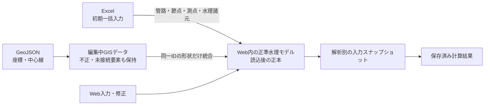

# GIS機能のalpha版範囲

## 結論

alpha版のGISは、既存のGeoJSONを**読み込み、接続を検証し、地図で確認して、WGS84で書き出す**ための機能とする。地図上でモデルを作成・修正する編集ソフトではなく、GISデータだけから完全な解析モデルを組み立てる機能でもない。

解析入力の正本はWeb内の[正準水理モデル](./canonical-hydraulic-model.md)である。Excelは初期一括入力、GISは実座標と管路中心線の入力元として使い、同じIDを持つ要素を正準水理モデルへ統合する。

## 機能評価

| 機能 | 状態 | alpha版で保証する範囲・制約 |
|---|---|---|
| GeoJSON読込 | 利用可能 | `Point`を節点、`LineString`を管路として読み込む。その他の形状は不正要素として保持する |
| 座標系の指定 | 利用可能 | EPSG:4326、EPSG:3857、JGD2011平面直角座標系I〜XIX、明示的なProj4定義を持つローカルXYに対応する。自動推定はしない |
| 属性の割り当て | 利用可能 | 節点ID・標高、管路ID・始終点ID・内径の列名を読込時に指定できる |
| 接続・入力検証 | 一部対応 | ID、数値、管路の始終点参照、内径を検証する。管厚、粗度、実延長、施設条件を含む完全性検証ではない |
| 不正要素の保持 | 利用可能 | 未接続・不正要素を破棄せず、比較案の`geoDrafts`に編集中データとして保存する |
| 地図表示 | 利用可能 | OpenLayersで点・線を表示し、選択要素を強調する。地物全体への自動ズームや地図上の選択編集は対象外 |
| 背景地図 | 利用可能 | 初期状態は通信なし。利用者が表示を選んだ場合だけOpenStreetMapの外部タイルへ通信する |
| WGS84 GeoJSON書出し | 利用可能 | 読み込んだ形状と属性をEPSG:4326へ変換して書き出す。ローカルXYは有効なProj4定義を必要とする |
| 正準水理モデルとの統合 | 一部対応 | 同じIDの節点座標・管路中心線だけを統合する。GIS値で管径等の水理諸元を上書きしない。不一致IDは自動追加しない |
| Excelとの同期 | 一部対応 | Excel由来の正準要素とGIS要素をIDで一方向に統合できる。双方向同期、競合解決、GISからExcelへの反映はない |
| GIS単独から解析モデルを作成 | 未対応 | 管厚、粗度、実延長、流量、境界条件等が不足するため、GIS接続検証の成功は解析実行可能性を意味しない |
| 地図上の作図・形状編集 | 未対応 | Draw・Modify・Snap操作、頂点編集、節点接続の修正はない |
| 解析結果の地図重畳 | 未対応 | 圧力・水頭の色分け、時刻別アニメーション、凡例との連動はない |

画面の検証表示は「GIS接続：有効／要確認」とし、「水理属性が解析可能な状態まで揃った」という意味には使わない。

## データの流れと責任分界

- 管路の接続、管種、内径、管厚、実延長、粗度の正本は正準水理モデルの管路とする。
- GISの正本範囲は、元の座標系で保持する節点座標と管路中心線とする。
- GISの同一IDが見つからない場合は、正準モデルへ推測で追加せず、編集中GISデータに残す。
- 解析は、正準モデルから解析方式ごとに作成した入力スナップショットを使う。`geoDrafts`を直接解析入力として扱わない。
- Excel再読込とWeb編集の上書き規則は[Excel入力とWeb入力の責任分界](./excel-web-input-policy.md)に従う。

## alpha版の完成条件

- 上表の「利用可能」を自動テストまたは画面確認で再現できる。
- 接続検証と解析モデルの完全性検証を、画面文言と処理上で区別する。
- GIS由来の形状を統合するとき、水理諸元を暗黙に上書きしない。
- CRSとローカルXYの変換定義を比較案に保存し、表示と書出しで同じ定義を使う。
- 背景地図を利用者の操作なしに外部取得しない。
- 不正・未接続要素を保存し、修正前の入力を失わない。

## 将来ロードマップ（Issue分割単位）

1. **管路読込後の平面図自動表示**（Issue #22）: 正準モデルから実座標図または模式図を自動生成し、接続不良を識別表示する。
2. **GISと正準モデルの統合画面**: 不一致IDの対応付け、属性競合の比較、採用値の明示、統合履歴を実装する。
3. **地図上の作図・修正**: 節点・管路の追加、頂点編集、スナップ、分割・結合、接続修正を実装する。
4. **GIS完全性検証**: 水理諸元・境界条件・施設条件を含め、解析方式ごとの不足項目を提示する。
5. **Excelとの双方向更新**: 正準モデルからExcelへ再出力し、再読込時の差分と競合を解決する。
6. **圧力波結果の地図重畳**（Issue #24）: 保存済み結果を用いた色分けと、縦断図に同期するアニメーションを実装する。

ロードマップ2〜5は、Issue #22〜#25へ暗黙に含めず、着手時にそれぞれ独立Issueとして作成する。
